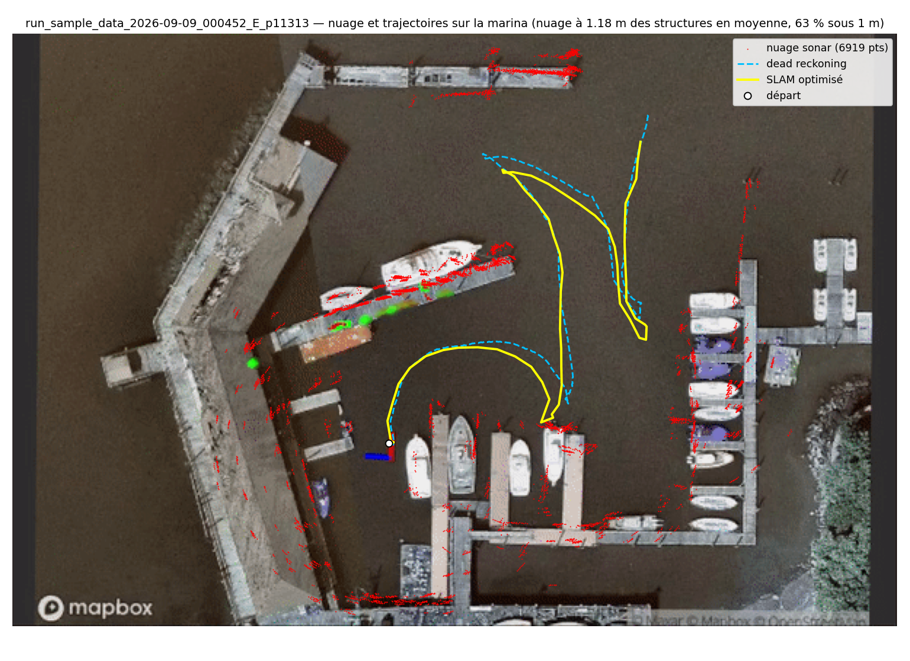
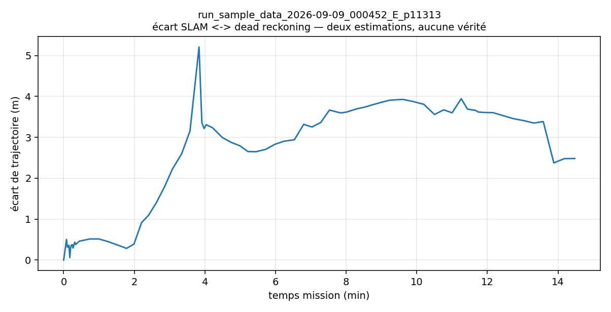
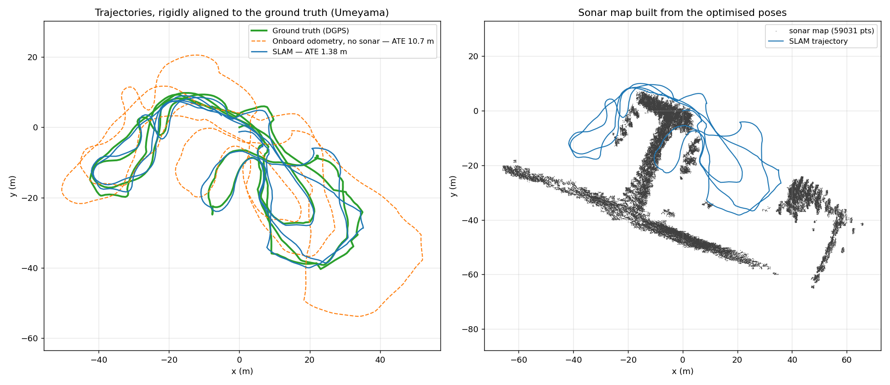

# Bruce-SLAM

Sonar-based graph SLAM for a BlueROV, extended during a 4th-year engineering internship
(Polytech Nantes, 2026).

This is a **fork of [jake3991/sonar-SLAM](https://github.com/jake3991/sonar-SLAM)** — the
original BlueROV sonar SLAM by **Jinkun Wang**, documented and maintained by
**John McConnell**. The SLAM core (feature extraction, scan matching, iSAM2 back-end) is
their work and is left untouched wherever possible. This fork adds a new dataset, a
simulation pipeline, an acoustic-positioning variant and evaluation tooling.


## What this fork adds

| Addition | Detail |
|---|---|
| Dataset | **Aracati2017**, a surface vessel with neither IMU nor DVL — bridges are required |
| Method | sonar SLAM anchored by **USBL** acoustic positioning, fully ground-truth-free |
| Simulation | **HoloOcean** scenario generator producing ROS bags without needing ROS |
| Evaluation | ATE against ground truth, and a ground-truth-free metric based on harbour structures |

## Branches

| Branch | Content |
|---|---|
| **`main`** | Bruce-SLAM on its own `sample_data.bag`, plus the analysis tooling. Start here. |
| **`Bruce`** | The original method applied to **Aracati2017**. |
| **`Bruce_Sonar_USBL`** | **The improved method**: sonar SLAM anchored by USBL acoustic fixes. |
| **`holoocean`** | **HoloOcean** simulation: scenario generation, bag writing, SLAM on synthetic data. |

Each branch carries its own `run_slam.sh` presets and its own analysis chain, because the
sensor suites differ.

## Installation

Python dependencies (unchanged from upstream):

```
cv_bridge  gtsam  matplotlib  message_filters  numpy  opencv_python  rosbag  rospy
scikit_learn  scipy  sensor_msgs  Shapely  tf  tqdm  pyyaml
```

ROS dependencies: **ROS Noetic**, `catkin-pybind11`, `catkin-tools`.

Then, in your catkin workspace:

```bash
git clone https://github.com/ethz-asl/libnabo.git
git clone https://github.com/ethz-asl/libpointmatcher.git
git clone <this repo>
catkin build
```

`setup_ros_noetic.sh` automates this on a clean Noetic install.

The custom message packages (`bar30_depth`, `rti_dvl`, `sonar_oculus`, `kvh_gyro`) must be
built in the workspace as well — otherwise bags replay but no subscriber matches.

Bags are not versioned here. `sample_data.bag` comes from the
[upstream repository](https://github.com/jake3991/sonar-SLAM), Aracati2017 from
[matheusbg8/aracati2017](https://github.com/matheusbg8/aracati2017), and HoloOcean bags are
generated locally.

---

# Part 1 — Getting started with `sample_data.bag`

The upstream bag contains exactly the four topics the original code expects, so **no bridge
is needed**. It is the shortest path to a working run, and the right place to start before
moving to Aracati2017.

| Topic | Rate | Type |
|---|---|---|
| `/vn100/imu/raw` | 198 Hz | `sensor_msgs/Imu` |
| `/rti/body_velocity/raw` | 5 Hz | `rti_dvl/DVL` |
| `/sonar_oculus_node/ping` | 5 Hz | `sonar_oculus/OculusPing` |
| `/bar30/depth/raw` | 4.2 Hz | `bar30_depth/Depth` |

879 s of survey in a marina. Run and analyse:

```bash
./run_slam.sh sample_data          # offline mode: the node reads the bag itself
./analyse.sh run_sample_data_<date>
```

Outputs, in `results/run_sample_data_<date>/`:

- `trajectory.csv` — optimised SLAM poses, with the dead-reckoning pose at each keyframe
- `dead_reckoning.csv` — raw IMU + DVL + pressure dead reckoning at 5 Hz
- `pointcloud.csv`, `constraints.csv` — map and accepted loop closures
- `carte_finale.png`, `error_over_time.png`, `carte_port.png`, `trajectoires_3d.html`

## Results

73 keyframes, 6 919 map points, 17 loop closures over 163 m travelled.



**There is no ground truth in this bag**, so no ATE can be computed. Two substitutes are
used instead:

- **Distance to harbour structures.** Quays, pontoons and hulls are extracted from the
  aerial view by Sobel filtering (horizontal, vertical, both diagonals), turned into a
  distance field, and the cloud is scored against it — a reference independent of any
  SLAM. Best run: **1.18 m mean distance, 63 % of points within 1 m**.
- **SLAM vs dead reckoning.** The sonar corrects the dead reckoning by about 2 % of the
  distance travelled. A much larger gap is a symptom, not a feature.



Two configurations are worth knowing, both reachable through `campagne_sample_data.sh`:

| Configuration | Mean distance to structures | Runs | Note |
|---|---|---|---|
| stock | 1.44 m | 4 | upstream defaults |
| `icp_odom_sigmas` halved | **1.26 m** | 6 | best accuracy; best single run at 1.18 m |
| `min_pcm: 3` | 1.30 m | 3 | **bit-identical across runs** |

Figures are averaged over repeated runs of each configuration, since a single run is not
representative on its own.

The last row matters: with the default `min_pcm: 2`, marginal loop closures are accepted
or rejected depending on callback timing, and the trajectory moves by 1.5 to 2 m between
two runs of the same bag. Raising the threshold to 3 makes the pipeline deterministic.

---

# Part 2 — Aracati2017

This is the main subject of the internship. Aracati2017 is a **surface vessel** surveying a
harbour, and it differs from the BlueROV on every count: **no IMU, no DVL**, and Cartesian
sonar images instead of `OculusPing`. Getting the original method to run on it, and then
improving it, is the core of the work.

Branch: `Bruce` for the adapted original method, `Bruce_Sonar_USBL` for the improved one.

## The dataset

43 min of survey, 58 168 messages, 9 GB. Measured directly from the bag:

| Topic | Rate | Type | Use |
|---|---|---|---|
| `/son/compressed` | 5.7 Hz | `sensor_msgs/CompressedImage` | imaging sonar, Cartesian |
| `/cmd_vel` | 5.7 Hz | `geometry_msgs/TwistStamped` | thruster commands, integrated into odometry |
| `/usbl_point` | 0.6 Hz | `geometry_msgs/PointStamped` | acoustic positioning fixes |
| `/usbl` | 0.6 Hz | `sensor_msgs/NavSatFix` | same, geographic coordinates |
| `/pose_gt` | 5.7 Hz | `geometry_msgs/PoseStamped` | ground truth, **evaluation only** |
| `/dgps_point` | 1.0 Hz | `geometry_msgs/PointStamped` | DGPS, source of the ground truth |
| `/dgps` | 1.0 Hz | `sensor_msgs/NavSatFix` | same, geographic coordinates |
| `/surface/compressed` | 3.0 Hz | `sensor_msgs/CompressedImage` | surface camera, unused |

## What had to be adapted

The SLAM core is untouched. Two minimal bridges make the dataset usable:

- **Odometry from `/cmd_vel`.** With no IMU and no DVL there is no dead reckoning at all,
  so thruster commands are integrated into a `nav_msgs/Odometry` stream. This drifts badly
  — which is precisely what the sonar has to correct.
- **Cartesian feature extraction.** The sonar publishes Cartesian images, not polar pings,
  so CFAR runs in Cartesian mode.

`/pose_gt` and the DGPS topics are read **for evaluation only**. The estimate itself never
sees them: it is computed from onboard sensors alone.

## Running it

```bash
SSM=true NSSM=true USBL=false ./run_slam.sh    # adapted original method
./analyse.sh run_aracati_<date>
```

## Results



Rigidly aligned to the ground truth (Umeyama), the usual ATE convention: the odometry
alone reaches **10.7 m** of error, while the SLAM stays at **1.38 m** over the 43 min
survey. Anchored at the first pose instead, without fitting a rotation — a stricter
convention that exposes accumulated drift — the same run gives 19.7 m and 4.5 m.

On the right, the map built from the optimised poses. The T-shaped pier and the two quays
come out straight and thin: that is the practical test that the trajectory is right, since
a wrong trajectory smears one structure into several parallel ghosts.

## The improved method: sonar + USBL

Branch `Bruce_Sonar_USBL`. USBL fixes are added as **robust unary position factors** in the
pose graph, constraining x and y while leaving heading free.

Two points that cost time and are worth stating:

- Heading is a **free gauge**. Acoustic positioning alone only half constrains it, so it
  has to come from the scan matching.
- Anchoring must happen **either** in the front-end **or** in the back-end, never both.
  Filtering the odometry with USBL while also adding USBL factors to the graph
  over-constrains it and makes the trajectory zigzag.

---

# HoloOcean simulation

Branch `holoocean`. Generates ROS bags from the
[HoloOcean](https://holoocean.readthedocs.io) simulator: imaging sonar, DVL, IMU and
pressure, along scripted trajectories in the PierHarbor scene.

```bash
python3 gen_bag_3d_v10.py      # writes BAG_files/holoocean_3d_traj9.bag
./run_slam.sh holoocean
```

> **HoloOcean must be installed to generate bags.** The scripts call `holoocean.make()`
> directly. Installing the Unreal client requires accepting the Epic Games EULA (an
> invitation is sent by email), and the client download is prone to truncating — using
> `wget -c` and then `holoocean.install(url="file://...")` works around it.
>
> Generation itself does **not** need ROS: bags are written with the pure-Python `rosbags`
> library. ROS is only needed to run the SLAM on them afterwards.

Sonar resolution is the parameter to watch: 1024 azimuth bins produce a striped image
(65 % of columns empty). Use 1024 range bins with 512 azimuth bins or fewer.

# Analysis tools

| Script | Purpose |
|---|---|
| `analysis/sample_data_report.py` | map, SLAM-vs-DR gap, overlay on the aerial view |
| `analysis/paper_eval.py` | ATE (Umeyama and origin-anchored), map sharpness |
| `analysis/bilan_run.py` | one-image summary of a run |
| `analysis/view3d_sample_data.py` | interactive 3D HTML of both trajectories |

`analyse.sh` picks the right chain from the run name.

# Credits

Original work by **Jinkun Wang**; documentation and maintenance by **John McConnell** —
[jake3991/sonar-SLAM](https://github.com/jake3991/sonar-SLAM). Vehicle hardware is
documented in [Argonaut](https://github.com/jake3991/Argonaut).

The **Aracati2017** dataset is released at
[matheusbg8/aracati2017](https://github.com/matheusbg8/aracati2017) — see that repository
for the authors, the recording conditions and the terms of use.

Fork and internship work: **Nathan Rasamijaona**, Polytech Nantes, 2026.

Licensed under the terms of the upstream `LICENSE`.
